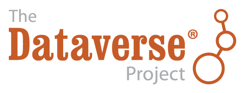
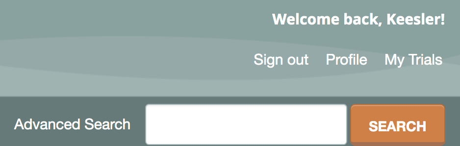
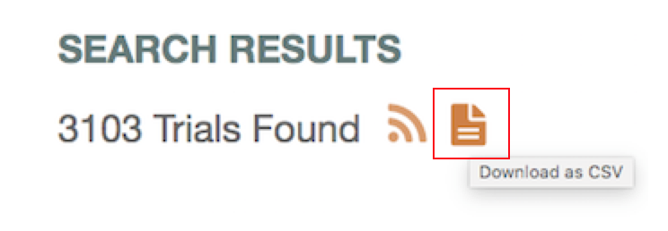

## TRIAL DATA ACCESS

### Downloading the Registry Data
The registry database is currently available for download through an accessible CSV (comma-separated values) file that compiles all current public information from each registered trial. We provide two options for downloading the data:

1. Downloading the monthly snapshots of the database from the AEA RCT Registry Dataverse.

2. Downloading a current snapshot of the database directly from the website. Directions for each downloading process are provided below.
Directions for each downloading process are provided below.

For a guide on the fields contained in the registry, please see [this documentation](https://www.socialscienceregistry.org/AEA_RCT_Registry_Data_Elements_Definitions.pdf).

For complete documentation on the change history of the registry, [please see here](https://www.socialscienceregistry.org/site/updates).

### Downloading from the AEA RCT Registry Dataverse

The [AEA RCT Registry Dataverse](https://dataverse.harvard.edu/dataverse/aearegistry) contains monthly, historical snapshots of the registry database. The Dataverse issues a citation and a DOI for each monthly version of the database. Data is uploaded at the beginning of every month. Researchers can cite a particular monthly dataset when doing analysis or making tables and graphs.

Visit the [AEA RCT Registry Dataverse](https://dataverse.harvard.edu/dataverse/aearegistry) to access the data.

### Downloading from the AEA RCT Registry Website
Another way to access the registry data is by clicking the “Download as CSV” icon on [the Advanced Search page](https://www.socialscienceregistry.org/trials/search). The website download will provide the current version of the data; however, the data changes as researchers update their trials. We recommend using the data posted on the Dataverse if you are looking to add a citation and make your analysis reproducible.

The CSV file is updated approximately every ten minutes with new trials and modifications. As a result, if a trial was registered near the time of your download it may not be included in the CSV.

Below are instructions on how to download the data:

- Step One: From the main homepage of the registry, please click “Advanced Search” next to the search bar. This will make all trials searchable.

- Step Two: Under “Search Results”, there is an option to download the trial information in a CSV file. Select the orange document button on the right.

- Step Three: The CSV file will now download. This will include all the public information from all published trials.

If you have any questions or issues access the registry data, please contact us at **support@socialscienceregistry.org**.
